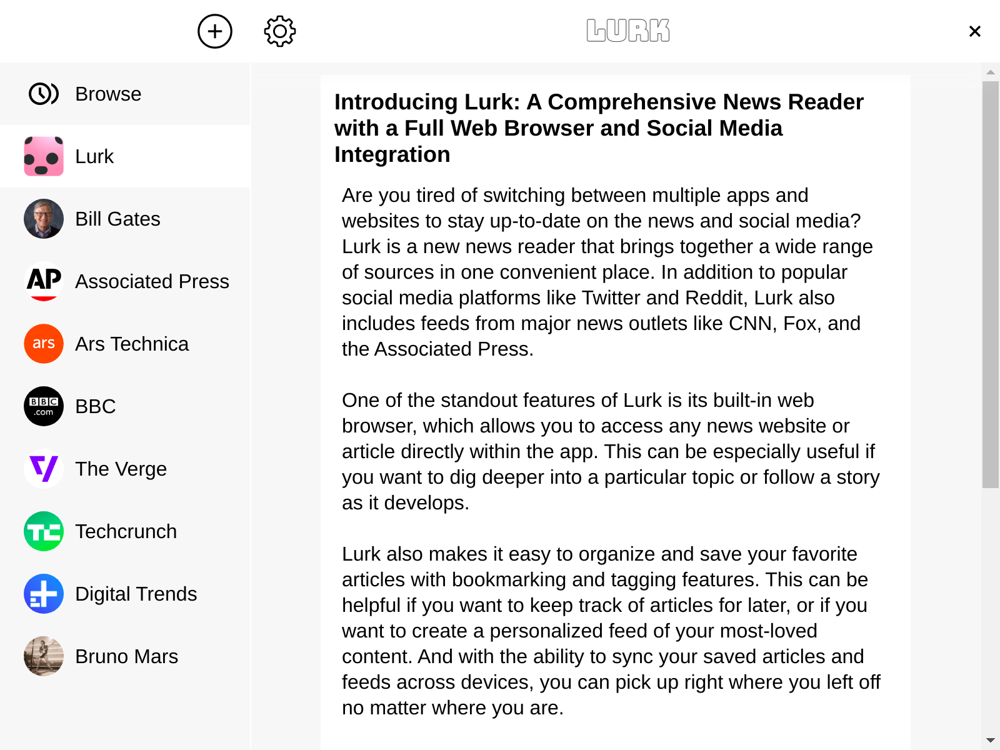

## Five Reasons To Love Lurk

- Wide range of sources, including social media and major news outlets
- Full web browser for accessing any news website or article within the app
- Customization options for organizing and saving your favorite articles
- Sync across devices to pick up where you left off on any device
- Offline mode for accessing saved articles and feeds without an internet connection
